# 反思：LKModel目前的问题和期望目标

## 现状与目标的差距

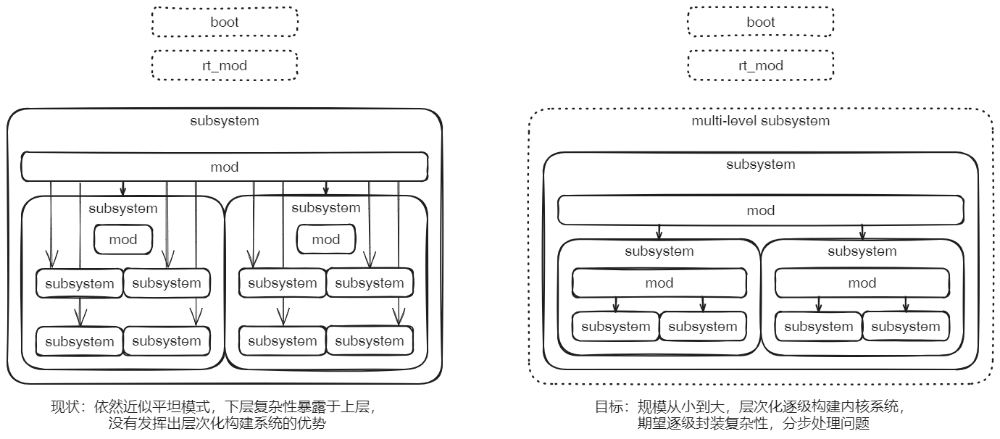

虽然提出了层次化构建内核系统的目标，但当前实现状况仍然停留在平坦管理的程度上，没能体现出采用这种设计方式的优势。

在此情况下，之前在组件间单向依赖方面所做的工作无法体现其意义，因为单向依赖只是实现层次化构建系统的条件和手段。

## 针对目标，下步的实践工作思路

以终为始，从构建目标-组件化**宏内核**开始，自顶向下逐级分解，对于每一级(子)系统：

1. 从对外交互角度分析系统需求：一方面是外部主动对系统触发的请求，另一方面是系统对外部的操作或反馈。
2. 与外部的交互体现系统整体的对外功能，要转化成具体的测试用例，主要由rt_XXX、test_XXX等根组件承担执行。
3. 针对功能需求，实现子系统，要能够通过测试用例。
4. 每个子系统由两层组成：底层是若干个下一级的子系统，它们需要提供基础功能支撑，这样就提出了对它们的功能需求，它们封装了底层实现细节，本级子系统只管调用它们的服务接口，不知道底层如何实现；上层就是一个组件，是本级系统的代表，它组织下层子系统，同时实现了本级子系统的功能增量。

综合上述4点，对各级子系统的需求可以自顶向下传递，每一级仅关注和处理本级的问题，这样有效的逐级分解复杂问题，直至最简单的问题。分析具体又分为两个方面：

### 宏内核的启动

在宏内核启动过程中，各层次子系统的分层与相互关系。

以下是一个粗略的分解图作为示例，后面需要更细致的分解和验证：

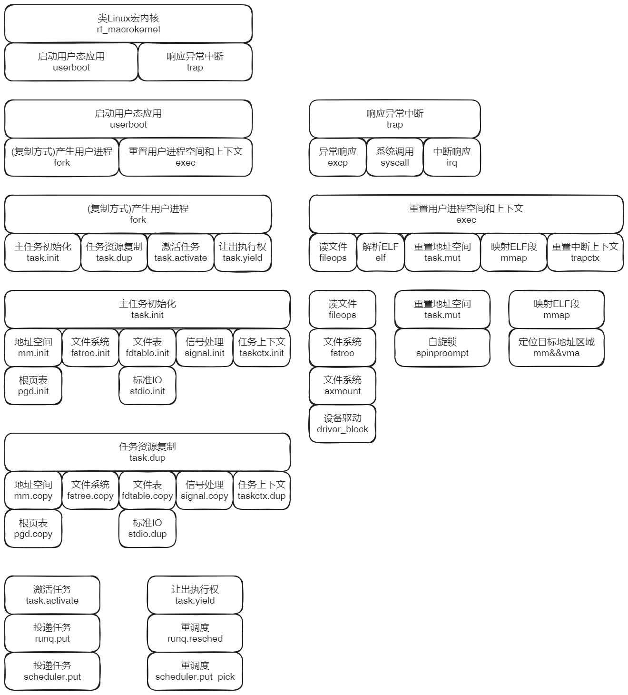

### 宏内核的运行

宏内核在运行过程中，随时处于响应外部的异常、系统调用和中断的状态。其中，系统调用的响应是主流。

这部分与宏内核的启动有重合，但是侧重点和覆盖面不同，所以单独作为一个方面进行分析。这方面的思路是：

1. 由外部应用触发的系统调用和异常、由设备触发的中断，构成对宏内核的需求，转化为测试用例。目前主要基于ltp。
2. 横向的批量分析测试用例，按照相关性分组需求，每一组需求落实到对应的子系统上，成为一个任务。
3. 按照第2点逐级向下分解，这样可以形成一系列的任务依赖图，上层任务依赖下层任务。
4. 根据上面的分析，确定各项任务对应实验的实现顺序。

任务的分解和完成同样是采取**层次化**方式，而非直接的垂直方式。上层相对独立的各个任务的需求，在下层可能是交叉的，交叉的部分要归纳合并成一个任务。具体来说，根据任务之间的依赖，可以判断出哪些任务是依赖的焦点，解决了它，就让一组上层任务取得了解决的条件。所以说，是根据依赖关系，自底向上逐层的解决问题，而不是从每个顶层任务开始，“竖井”式的一直扎到底的解决方式。

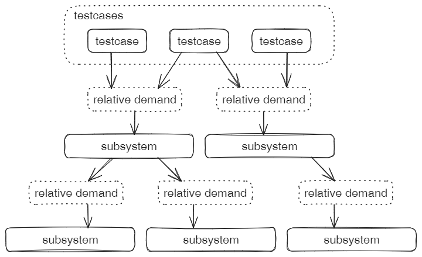


# 组件系统构成

## 组件系统层次模型

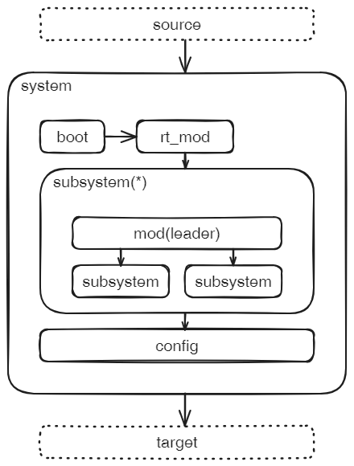

系统system是可以独立运行的实体。

子系统subsystem，具有独立的功能，不依赖其他子系统，它不能独立运行，仅仅作为系统构成的基础部分。

> 注：子系统subsystem(*)后面的**星号**表示，根组件rt_mod管理的子系统subsystem可以是零到多个。

组件分为三类：

1. 根组件(rt_XXX，test_XXX，bench_XXX，...)

   根组件代表一个独立运行的系统（system）。

   系统由它本身加上框架组件boot、config以及所管理的子系统（subsystem）共同构成。

   根组件包含一个初始化函数init和运行函数run。

   函数init完成系统的初始化，函数run正式启动系统，能够响应外部请求。

2. 功能组件

   功能组件封装了相对独立和内聚的特定功能。

   每个功能组件都可以以它自身为leader，与所依赖的组件共同构成一个独立的功能子系统。

   功能组件包含一个初始化函数init，负责初始化它引领的子系统。该函数可以是空实现。

   功能组件还包含一到多个接口，每个接口是一组相关的函数，提供一个方面的服务。

3. 框架组件

   包含系统启动组件boot和系统配置组件config。

   组件config提供lds链接脚本、系统参数和条件编译选项。


## 组件系统过程模型

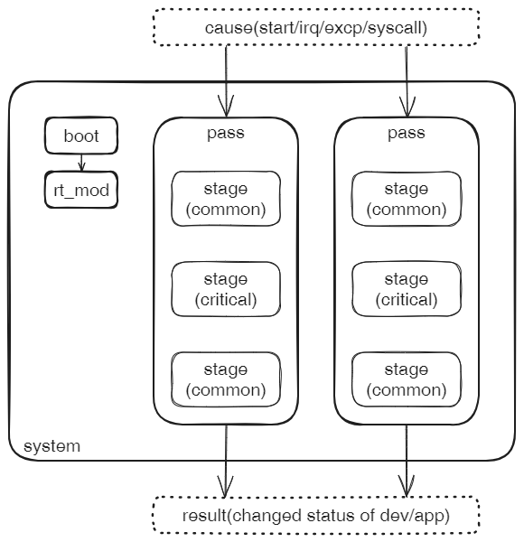

过程模型就是在一个子系统中，分为趟（Pass）和阶段（Stage）。Pass是一个相对独立的完整的过程，而Stage是过程中的一个连续运行的阶段。两个例子：

* mmap映射：实际包括两个相对独立的过程，Pass0和Pass1。Pass0只负责建立虚拟内存地址区域，并不负责分配实际物理页面并与之建立映射关系，它从syscall发起，到建立vma结束；Pass1即由缺页异常触发的映射关系的完成，期间可能会去申请物理页面和加载对应文件块的内容。两趟Pass共同完成mmap映射，有因果关系，但它们之间又是相对独立的两个过程。
* SMP共享访问资源：每个CPU的过程都是一趟Pass，对每个Pass来说，访问共享资源是一个特殊的Stage，其它Stage则是各个CPU过程独占的阶段，当跨越阶段边界时，通常意味着等待和唤醒等状态的变化，这些边界通常是**状态一致点**。

过程模型想要解决的问题：把一个子系统按照过程维度，分解成多个Pass，再进一步把每一个Pass分解为多个Stage。按照先简单问题，后问题综合叠加的思路，来处理复杂性问题。

每一个Pass都可以看作是由一个事件触发的，由一连串阶段构成的，会导致一定结果的场景。触发事件主要包括：启动事件、syscall调用（可能还要区别具体参数）、异常、访问procfs/sysfs的特定结点（从syscall_read中单立出来）。中间的各个阶段就是stage。最终结果包括：应用或硬件或仅仅是内核内部状态发生变化。

**当前阶段的问题：**之前主要是从引导启动这一过程的角度进行分析，其实系统启动后，从syscall/excp/irq触发的过程才是主流，它们都是独立的过程，需要把这些过程与启动过程综合考虑。这个分析能够增强对内核构成的认识，可能会引起层次化模型的调整。


## 基于模型解决复杂问题

解决问题分为两个阶段，自顶向下分解问题的阶段和自底向上综合结果的阶段。

> 问题以需求的方式提出，转化为可以执行的测试用例；测试用例通过表明满足需求，满足标志问题的解决。

### 分解阶段

1. 给定一个系统system，通过分析它与外界的交互，确定需求，需求转化成测试用例
2. 系统中唯一的根组件rt_mod负责组织若干的子系统subsystem，协同完成系统的需求
3. 系统需求转化为对每个子系统的需求，需求转化为测试用例
4. 子系统可以无限嵌套层级，每一层完成**有限**的需求，向下使用下层服务，向上层提供服务，形成**纵向**的分层关系
5. 支撑子系统的若干直接子系统之间形成**横向**的并列关系，这些直接子系统位于同一层，可以无限拆分
6. 迭代使用第3点和第4点，不断按照纵向和横向分解问题，直到复杂度可控可接受的粒度

### 综合阶段

上一阶段逐层逐块分解获得一系列不同规模的子系统，最小粒度的子系统是末端子系统。

1. 以末端子系统为起点，按照分解关系向上级综合，验证综合得到的上级子系统，能够通过测试用例，即满足需求
2. 迭代应用第1点，直至顶层系统，确认通过顶层系统的测试用例 - 满足需求


该方法实质是：把一个复杂问题，转化成一定规模的简单问题，逐个解决，再综合解决问题的结果。

每一步要解决问题的复杂性降低了，代价是问题规模变大了。

子系统的纵向/横向分解能力是转化和解决问题的关键。

过程中需要关注的**焦点**是 子系统的leader组件，它组织下级子系统和自身功能完成需求。它既不关心上级子系统/系统的需求等问题，因为那些超出当前要解决的问题领域；也不关心下级子系统封装的内部细节，只通过下级接口获得服务，因为按照模型要求，逻辑上来说，下级子系统已经完成了需求验证。

每一步只把精力集中到当前子系统，具体来说，是集中到当前子系统的leader组件，充分做好当前问题的分析、综合和验证。等到所以步骤都按照上述既定顺序完成，就解决了复杂问题。

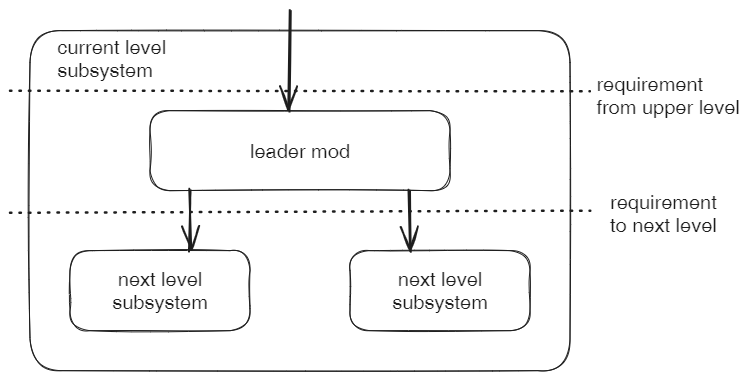

如图，每一级子系统需要解决的问题，只在两条虚线之间。


## 接口规格的形式

上面说到，每一级子系统的实现，就是对该子系统leader组件的实现，局限在两条需求线之间。

需求的表现形式就是接口的规格定义，分别是上层接口（实现）和下层接口（需求）。

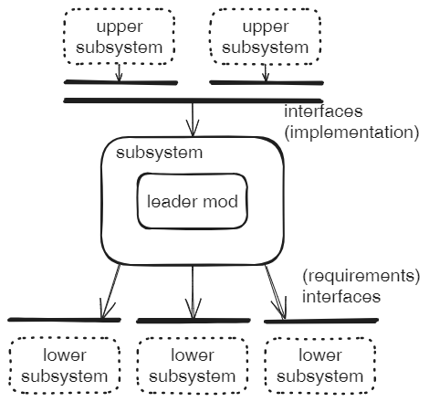

* 上层接口：来自所有上层的子系统对本子系统的调用需求，以接口集合的形式表示。本子系统也即leader组件的任务就是实现上层接口。
* 下层接口：leader组件需要调用一系列子系统的服务，来完成本级的任务。对各个下级子系统的需求，以接口表示。仅能通过接口访问下级子系统，不了解各个子系统的内部复杂细节。

通过上下接口，把本级子系统的开发和维护任务，限制于两层接口之间。一方面任务具有独立性，可以独立分配，也有利于集中精力把当前问题做扎实；另一方面通过需求（接口规格）传递的方式，对每个任务的解决结果，可以逐级综合起来去解决复杂的大规模系统问题。

由于启动过程是必须的，所以无论上层/下层接口，都包含Init接口，它如下两个方法：

```rust
pub fn init(cpu_id: usize, dtb_pa: usize);
pub fn start(cpu_id: usize, dtb_pa: usize);
```

* init是必须提供的方法，负责初始化当前子系统和下级子系统；
* start是可选的方法，负责把当前子系统设置为可用的待命状态；

> 下面各节中在启动过程的接口规格，默认都包含Init接口


# 实验环境准备

1. 克隆工程并切换分支

   ```sh
   git clone git@github.com:shilei-massclouds/lkmodel.git
   cd lkmodel
   git checkout tutorial
   ```

2. 编译lktool工具和设置环境变量

   ```sh
   cd tools/lktool/
   cargo build
   cd -
   export PATH=./tools/lktool/target/debug:$PATH
   alias lk='lktool'
   ```

   > 注：第4行，PATH环境变量相对于lkmodel的根目录，因此只能在lkmodel根目录下执行lktool工具

3. 实验步骤（以rt_macrokernel为例）

   ```sh
   lk config riscv64
   lk chroot rt_macrokernel
   lk prepare
   lk run
   ```

4. 自底向上批量执行各级实验

   ```sh
   lk test
   ```

   自动遍历Repo.toml的[root_list]，逐个执行上面第3点的实验测试。

5. 关于基于LTP的实验

   目前仍然是针对ltp测试集中mmap的测试，具体分析见倒数第二部分。

   ltp在设计上自带检查机制，应该是比较符合我们需要。另外，暂时只针对mmap这一组即可，它其实不止针对mmap，本身就覆盖了glibc和ltp框架本身，同时还涉及了许多基础的系统调用。可以把它作为基础。

   

# 类Linux宏内核macrokernel

## 系统构成

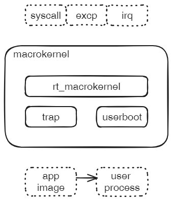

宏内核系统对外提供两方面交互服务：

1. 响应外部的中断、异常和系统调用（syscall通常是异常的一类）
2. 在启动阶段，从存储介质取出默认的应用程序文件，作为首个用户态应用启动

宏内核系统不含功能组件，直接由rt_macrokernel组织两个子系统trap和userboot构成系统，它们分别支持上述两个对外服务。

## 接口规格

### 过程1 - 启动

Init接口：从上层接口传递与下层的userboot和trap的Init接口

### 过程2 - syscall

传递syscall给trap

### 过程3 - 异常

传递异常给trap

### 过程4 - procfs/sysfs

具体列表见procfs和sysfs两个组件


## 实验0.0

* 涉及组件

  rt_macrokernel

  trap

  userboot

* 操作步骤

  ```sh
  lk chroot rt_macrokernel
  lk prepare
  lk run
  ```

* 预期结果

  ```sh
  [userland]: Hello, Init! Sqrt(1048577) = 35190
  ```


# 异常中断响应trap

## 系统构成

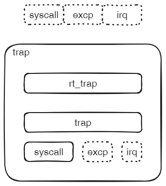

系统trap负责响应外部发出的请求，包括系统调用、（普通）异常和中断。

本级同名组件(ax)trap，提供框架并组织三类子系统。

目前子系统excp和irq还没有从组件(ax)trap中独立出去。

## 接口规格

rt_trap符合根组件标准接口。

作为leader的trap组件接口：

```rust
pub fn init(cpu_id: usize, dtb: usize);
pub fn start(cpu_id: usize, dtb: usize);
```

对子系统接口需求：

1. syscall组件接口。只有init，没有start。

   ```rust
   pub fn init(cpu_id: usize, dtb: usize);
   ```

2. excp组件接口（尚未独立出来）

   ```rust
   pub fn init(cpu_id: usize, dtb: usize);
   ```

3. irq组件接口。init负责注册handler，start负责启用中断。

   ```rust
   pub fn init(cpu_id: usize, dtb: usize);
   pub fn start(cpu_id: usize, dtb: usize);
   ```

   

## 实验0.1

> 注：当前命名是rt_axtrap和axtrap，以后更名

* 涉及组件

  rt_trap - 0.1

  trap - 1.1

* 操作步骤

  ```sh
  lk chroot rt_axtrap
  lk prepare
  lk run
  ```

* 预期结果

  查看日志输出如下。目前需要Ctrl+A X强制退出，以后改为sleep一段时间后退出。

  ```sh
  [  0.052029 axtrap:26] Initialize systemcalls ...
  [  0.053123 run_queue:32] timer tick ...
  [  0.054451 axtrap::arch::riscv:68] Exception(Breakpoint) @ 0xffffffc080201396
  [  0.063471 run_queue:32] timer tick ...
  [  0.073059 run_queue:32] timer tick ...
  [  0.083048 run_queue:32] timer tick ...
  ```


# 启动首个用户应用userboot

## 系统构成

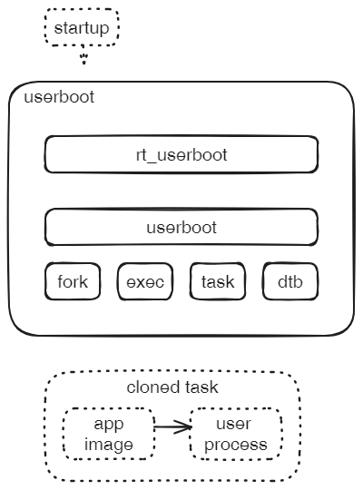

userboot负责加载和启动第一个用户态进程。在此之前，只有一个内核态线程在运行，称为task 0。

通过fork子系统，克隆一个新的任务task 1；然后在该任务的执行过程中，由exec子系统负责，从根文件系统中加载应用介质，解析后替换task 1的地址空间和中断上下文；最后执行权回到fork子系统，它的创建目标实质上都是用户态任务，即默认最后一步会通过中断上下文恢复现场，返回到用户态执行。

结果：第一个用户态应用任务被启动，它有自己独立的地址空间，是系统中第一个用户进程。

另外两个地位稍低的子系统是task和dtb。

task本身已经被嵌套在fork子系统中，这里直接需要调用的目的：task 0在克隆task 1之后，需要通过主动yield，让给task 1运行。

dtb负责解析BootLoader传入的系统信息。对riscv是fdt树的形式，对x86_64则是mbi形式（待实现）。

## 接口规格

rt_userboot符合根组件标准接口。

作为leader的userboot组件接口：

```rust
pub fn init(cpu_id: usize, dtb: usize);
pub fn start(cpu_id: usize, dtb: usize);
```

对子系统接口需求：

1. fork组件接口

   通过复制当前task产生新的task，通过CloneFlags指定对每一种资源是进行复制还是共享，最后通过中断上下文返回用户态运行。

   返回用户态之前，调用函数f，可以在内核态执行特殊的处理。对于userboot，通过函数f，完成了新应用的exec过程。

   ```rust
   pub fn user_mode_thread<F>(f: F, flags: CloneFlags) -> Tid
   	where F: FnOnce() + 'static；
   ```

2. exec组件接口

   给出一个应用程序的路径，exec组件完成解析（ELF），据此完成当前进程地址空间和上下文的替换。

   ```rust
   pub fn kernel_execve(path: &str);
   ```

3. task组件接口：

   当前任务主动让出执行权。

   ```rust
   pub fn yield_now();
   ```

4. dtb组件接口

   dtb组件遍历fdt树，对每一个结点调用cb回调函数，传入四个参数：结点名，寄存器区域的地址/长度单元个数，结点集合。

   调用者负责实现cb回调函数，首先根据结点名和属性集合判断是否当前关心的信息，然后采取解析或者忽略的动作。

   ```rust
   pub fn parse<F>(dtb_va: usize, mut cb: F)
   	where F: FnMut(name: String, addr_cells: usize, size_cells: usize, props: Vec<(String, Vec<u8>)>);
   ```

## 实验0.2(暂缺)

这个实验暂缺。直接复用实验0.0。

因为它目前依赖trap子系统，实验设置与macrokernel完全相同，目前无意义。

后面要实现该系统的单纯功能：不依赖异常、系统调用和中断，完成首个用户态应用的加载和启动。


# 克隆产生用户进程fork

## 系统构成

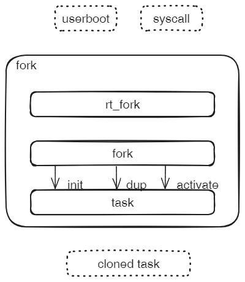

Fork系统以克隆的方式产生新的用户进程，它的上级使用者包括userboot和syscall。

作为leader的fork组件具体完成两步操作：

1. 复制当前task，产生新的task。
2. 把新产生的task投递到runq队列，等待调度。这一步通常称为wakeup。

## 基本流程

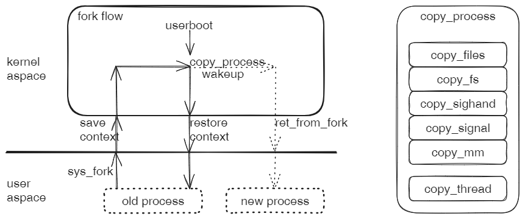

对于syscall发起的请求，fork从发起系统调用的用户进程开始，走一个完整的闭环流程；而对于userboot，只执行后半程。

无论从哪里发起，fork都会执行copy process、wakeup process和ret_from_fork这三步，产生一个新的用户态进程。

1. copy process：根据CloneFlags的要求，新进程对原有进程的各种资源，进行完全复制或者仅共享。其中，copy_thread除了拷贝原进程的寄存器上下文之外，还有可能把一个处理函数插入到流程中，在返回用户态之前调用，这个处理函数由请求者（syscall或userboot）在调用fork时指定。
2. wakeup：把新进程的task投递到runq，等待调度。注：fork流程中不包括调度，因此并不真正启动新进程。
3. ret from fork：从内核态返回到用户态的一系列特殊动作。因为是新产生的进程，与一般返回用户态的动作流程有一定区别。


## 接口规格

rt_fork符合根组件标准接口。

作为leader的fork组件接口：

1. user_mode_thread

   通过复制当前task产生新的task，通过CloneFlags指定对每一种资源是进行复制还是共享，最后通过中断上下文返回用户态运行。

   返回用户态之前，调用函数f，可以在内核态执行特殊的处理。

   ```rust
   pub fn user_mode_thread<F>(f: F, flags: CloneFlags) -> Tid
   	where F: FnOnce() + 'static；
   ```

2. do_fork

   XXX

3. XXX


## 实验0.3

* 涉及组件

  rt_fork - 0.3

  fork - 1.2

* 操作步骤

  ```sh
  lk chroot rt_fork
  lk prepare
  lk run
  ```

* 预期结果

  查看日志输出如下。其中，第2和第3两行中`[new process]:`表明fork成功，在新进程中运行。

  ```sh
  [  0.061894 taskctx:296] CurrentCtx::set_current 0 -> 1...
  [  0.063284 rt_fork:47] [new process]: enter ...
  [  0.063861 rt_fork:51] [new process]: yield ...
  [  0.064703 taskctx:296] CurrentCtx::set_current 1 -> 0...
  [  0.065612 rt_fork:37] [rt_fork]: ok!
  ```

> 注：需要扩展test_fork的一系列测试，验证可以返回到用户态中运行。


# 重置用户空间和上下文exec

## 系统构成


系统exec的请求者包括userboot和syscall。

子系统leader组件exec组织下列子系统完成对当前进程地址空间和中断上下文的替换。

## 基本流程

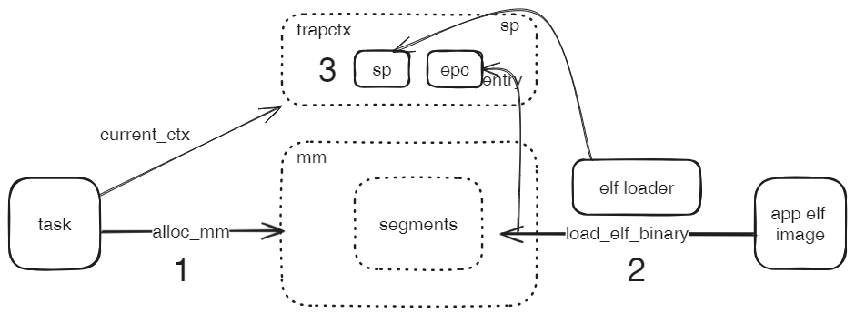

1. task的alloc_mm函数，脱离原有的mm地址空间，新建一个独占的mm地址空间
2. elf_loader的load_elf_binary函数，负责打开应用文件，按照ELF格式解析，把需要加载的段映射到当前任务的mm地址空间，同时获得应用entry的地址
3. user_stack新建一个用户栈，填充args和envs以及应用文件路径等参数
4. trapctx的start_thread函数用用户栈的地址设置sp寄存器，用第2步获得的entry设置epc寄存器

子系统exec并不负责真正启动应用，它仅仅是在内核栈保存的异常上下文中设置好相应寄存器，同时准备好地址空间。等当前的任务返回用户态时，会基于这些准备把应用真正启动起来，这部分超出了exec的职责范围。

## 实验0.4

* 涉及组件

  rt_exec - 0.4

  exec - 1.3

  fileops - 

  elf -

  task -

  mmap -

  trapctx -

* 操作步骤

  ```sh
  lk chroot rt_exec
  lk prepare
  lk run
  ```

* 预期结果

  查看日志输出如下。

  ```sh
  [userland]: Hello, Init! Sqrt(1048577) = 35190
  [  2.994594 rt_exec:39] panicked at sys/sys/src/lib.rs:311:9:
  internal error: entered unreachable code
  ```

> 注：因为不支持syscall，也就无法正常处理exit。最后以panic！结束。

## 后面工作

独立组件trapctx.start_thread(from axhal)。


# 解析应用程序bprm_loader

## 系统构成

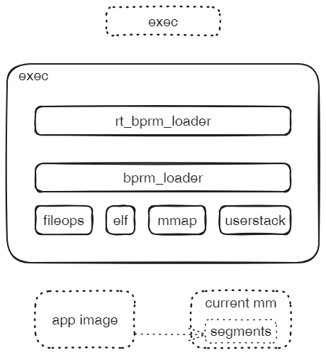

leader组件bprm_loader基于应用程序重置当前进程的地址空间。在四个子系统配合下完成工作。

1. 通过fileops打开和读应用程序。
2. 通过elf解析应用程序文件头信息和各段信息。
3. 通过mmap把标记为LOAD的各段映射到当前进程地址空间的指定位置。
4. 通过userstack构造用户栈，映射到当前进程的地址空间。

> **考虑**：把load_elf_binary和load_elf_interp公开出来，把userstack挪到上一层exec子系统中调用。

## 实验0.5

### 涉及组件

rt_bprm_loader

bprm_loader

fileops

elf

mmap

userstack

### 操作步骤

```sh
lk chroot rt_bprm_loader
lk prepare
lk run
```

### 预期结果

查看日志输出：

```sh
[  1.099821 rt_bprm_loader:39] panicked at bprm_loader/rt_bprm_loader/src/main.rs:34:5:
Reach here! entry: 0x2AAAABB5A4; sp: 0x3FFFFFFF70
[  1.107516 axhal::platform::riscv64_qemu_virt::misc:3] Shutting down...
```

> 后面工作：通过readelf解析目标应用，获得entry，并检查。对sp的位置进行assert验证。


# 用户栈userstack

## 系统构成

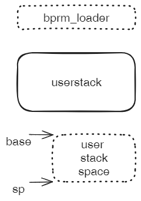

## 实验0.6

### 涉及组件

rt_user_stack

user_stack

### 操作步骤

```sh
lk chroot rt_user_stack
lk prepare
lk run
```

### 预期结果

查看日志输出：

```sh
[  0.114423 rt_user_stack:17] [rt_user_stack]: ...
[  0.120748 rt_user_stack:49] [rt_user_stack]: sp 0x3FFFFFFFA4 ok!
```

> 后面工作：处理可能的各种复杂情况，必要时增加test_XXX测试系统。


# 文件操作fileops

## 系统构成

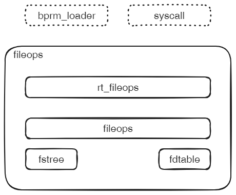

## 实验0.7

### 涉及组件

rt_fileops

fileops

fstree

fdtable

### 操作步骤

```sh
lk chroot rt_fileops
lk prepare
lk run
```

### 预期结果

查看日志输出：

```sh
[  0.690593 axmount::fs::fatfs:140] create Dir at fatfs: /proc
[  0.718091 axmount::fs::fatfs:120] lookup at fatfs: /proc
[  0.918987 axmount::fs::fatfs:140] create Dir at fatfs: /sys
[  0.941349 axmount::fs::fatfs:120] lookup at fatfs: /sys
[  0.965182 target:140] Is a directory
[  0.993977 rt_fileops:15] [rt_fileops]: ok!
```

> 后面工作：验证可以读各个文件系统下的文件。


# 地址空间映射mmap

## 系统构成

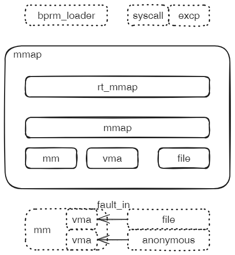

## 实验0.8

### 涉及组件

rt_mmap

mmap

mm && vma

file

### 操作步骤

```sh
lk chroot rt_mmap
lk prepare
lk run
```

### 预期结果

查看日志输出：

```sh
[  0.226231 rt_mmap:25] [rt_mmap]: ok!
[  0.228854 axhal::platform::riscv64_qemu_virt::misc:3] Shutting down...
```

> 后面工作：验证mmap的各种参数组合，需要扩展到test_XXX。


# 进程资源管理task

## 系统构成

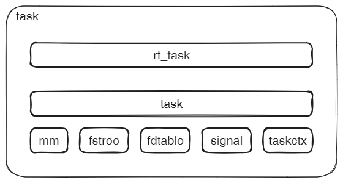

leader组件task是进程资源的管理者和中介，上层各个子系统都要通过task（主要是task::current）来访问进程的各个资源。

每种资源对应一个子系统，包括：地址空间mm，文件系统树，文件描述符表，信号集和处理signal，任务上下文taskctx。

## 实验0.9

### 涉及组件

rt_task

task

mm && vma

fstree

fdtable

signal

taskctx

### 操作步骤

```sh
lk chroot rt_task
lk prepare
lk run
```

### 预期结果

查看日志输出：

```sh
[  0.223268 rt_task:25] [rt_task]: ok!
[  0.226748 axhal::platform::riscv64_qemu_virt::misc:3] Shutting down...
```

> 后面工作：验证task 0的初始化。


# 进程地址空间mm

## 系统构成

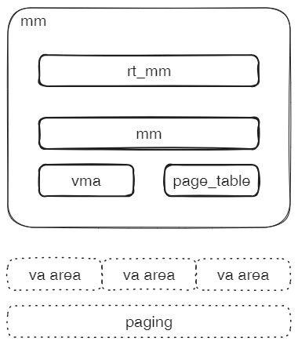

## 实验0.10

### 涉及组件

rt_mm

mm

page_table

### 操作步骤

```sh
lk chroot rt_mm
lk prepare
lk run
```

### 预期结果

查看日志输出：

```sh
[  0.219374 rt_mm:25] [rt_mm]: ok!
[  0.221772 axhal::platform::riscv64_qemu_virt::misc:3] Shutting down...
```

> 后面工作：验证地址空间段的映射和解除映射。增加test_xxx测试map与page_fault的联合。


# 进程文件系统视图fstree

## 系统构成

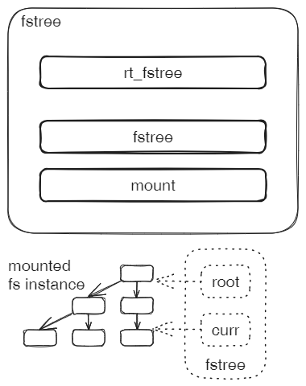

## 实验0.11

### 涉及组件

rt_fstree

fstree

mount

### 操作步骤

```sh
lk chroot rt_fstree
lk prepare
lk run
```

### 预期结果

查看日志输出：

```sh
[  0.138114 axfs_vfs:256] ============== mount ...
[  0.138519 axmount::fs::fatfs:140] create Dir at fatfs: /sys
[  0.140492 axmount::fs::fatfs:120] lookup at fatfs: /sys
[  0.142422 target:140] Is a directory
[  0.145452 rt_fstree:20] cwd: /
[  0.145889 rt_fstree:22] [rt_fstree]: ok!
```

> 后面工作：验证对目录树和文件的其它操作。


# 展开文件系统mount

## 系统构成

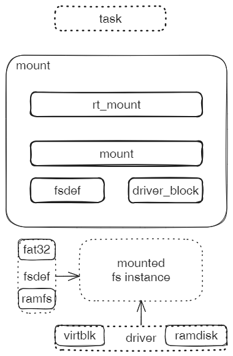

立体展开文件系统，形成由目录和文件构成的树。

对于有后备的文件系统，解析并展开存储在块设备中的扁平的序列化的文件系统数据；

对于伪文件系统，直接建立立体化的目录文件树。


## 实验0.12

### 涉及组件

rt_mount

mount

fs(fat32, ramfs)

block_driver(virtio_blk, ramdisk)

### 操作步骤

```sh
lk chroot rt_axmount
lk prepare
lk run
```

### 预期结果

查看日志输出：

```sh
[  0.151517 rt_axmount:54] test create file "/testcases/new-file.txt":
[  0.152334 axfile::fops:183] open file: /testcases/new-file.txt WRITE | TRUNC | CREATE
[  0.153378 axfs_vfs:285] lookup at root: /testcases/new-file.txt
[  0.153939 axmount::fs::fatfs:120] lookup at fatfs: testcases/new-file.txt
[  0.292016 axfile::fops:183] open file: /testcases/new-file.txt READ
[  0.292745 axfs_vfs:285] lookup at root: /testcases/new-file.txt
[  0.293300 axmount::fs::fatfs:120] lookup at fatfs: testcases/new-file.txt
[  0.301016 rt_axmount:60] read test file: "create a new file!
"
[  0.304138 rt_axmount:63] [rt_axmount]: ok!
```

> 后面工作：验证对各种文件系统定义和块设备驱动的交叉操作。


# 文件描述符表fdtable

## 实验0.13

### 涉及组件

XXX

### 操作步骤

```sh
lk chroot rt_xxx
lk prepare
lk run
```

### 预期结果

查看日志输出：


# 文件file

## 系统构成

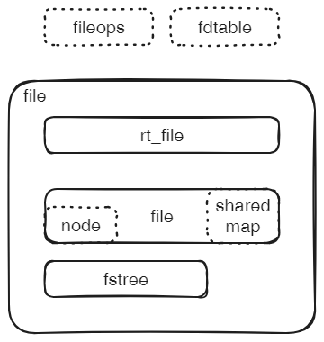

file是文件系统中结点node的高层封装。

当前实现中，file还维护一个shared_map（offset->pa），用于记录共享区域对应的物理页地址。当多个进程地址空间mm的vma共享该段区域时，实际上各自的va都是指向这一个相同的pa。


## 实验0.14

### 涉及组件

XXX

### 操作步骤

```sh
lk chroot rt_xxx
lk prepare
lk run
```

### 预期结果

查看日志输出：


# 文件系统rust_fatfs

## 实验0.15

### 涉及组件

XXX

### 操作步骤

```sh
lk chroot rt_xxx
lk prepare
lk run
```

### 预期结果

查看日志输出：


# 块设备驱动virtblk

## 实验0.16

### 涉及组件

XXX

### 操作步骤

```sh
lk chroot rt_driver_virtio
lk prepare
lk run
```

### 预期结果

查看日志输出：

```sh
[  0.084929 rt_driver_virtio:65] [rt_driver_virtio]: ok!
```


# 块设备驱动ramdisk

## 实验0.17

### 涉及组件

XXX

### 操作步骤

```sh
lk chroot rt_driver_block
lk prepare
lk run
```

### 预期结果

查看日志输出：

```sh
[  0.046933 rt_driver_block:47] [rt_ramdisk]: ok!
```


# 文件系统ramfs

## 实验0.18

### 涉及组件

XXX

### 操作步骤

```sh
lk chroot rt_xxx
lk prepare
lk run
```

### 预期结果

查看日志输出：


# 文件系统procfs

## 实验0.19

### 涉及组件

XXX

### 操作步骤

```sh
lk chroot rt_xxx
lk prepare
lk run
```

### 预期结果

查看日志输出：

### 待办任务

1. 实现单独的高层组件proc_ops，维护path->ops映射，对需要动态组装信息的文件结点提供ops处理方法。
2. 实现对/proc/self的处理，它是/proc/[pid]的特例。


# 互斥锁mutex

## 实验0.20

### 涉及组件

XXX

### 操作步骤

```sh
lk chroot rt_mutex
lk prepare
lk run
```

### 预期结果

查看日志输出：

```sh
[  0.032055 rt_mutex:20] [rt_mutex]: ...
[  0.034355 axalloc:213] initialize global allocator at: [0xffffffc080273000, 0xffffffc088000000)
[  0.038137 task:287] Initialize schedule system ...
[  0.039305 task:236] CurrentTask::init_current...
[  0.040092 rt_mutex:37] 0
[  0.040629 rt_mutex:40] [rt_mutex]: ok!
```


# 等待队列waitq

## 系统构成


WaitQ最基本的使用是父任务对子任务的等待收割。


## 实验0.21

### 涉及组件

XXX

### 操作步骤

```sh
lk chroot rt_xxx
lk prepare
lk run
```

### 预期结果

查看日志输出：


# 运行队列runq

## 系统构成

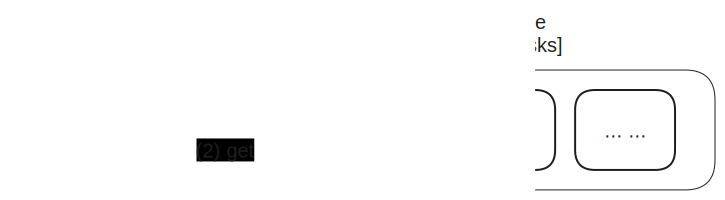

## 实验0.22

### 涉及组件

XXX

### 操作步骤

```sh
lk chroot rt_xxx
lk prepare
lk run
```

### 预期结果

查看日志输出：


# 任务上下文taskctx

## 基本过程

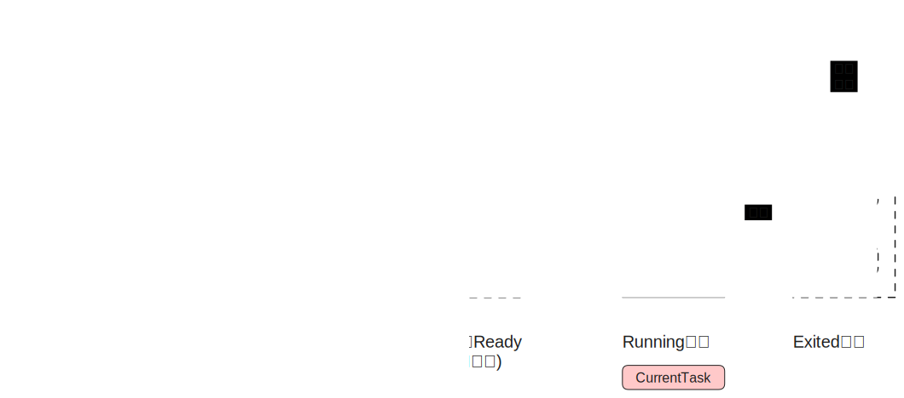

## 实验0.23

### 涉及组件

XXX

### 操作步骤

```sh
lk chroot rt_xxx
lk prepare
lk run
```

### 预期结果

查看日志输出：


# 异常上下文trapctx

## 基本流程

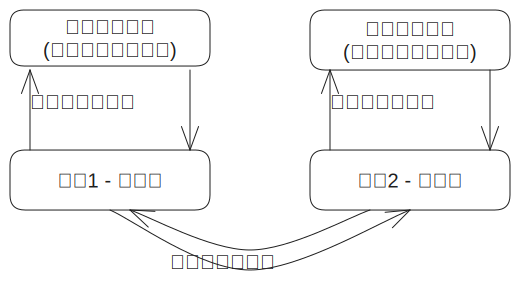

## 实验0.24

### 涉及组件

XXX

### 操作步骤

```sh
lk chroot rt_xxx
lk prepare
lk run
```

### 预期结果

查看日志输出：


# 页表page_table

## 系统构成

## 地址空间布局

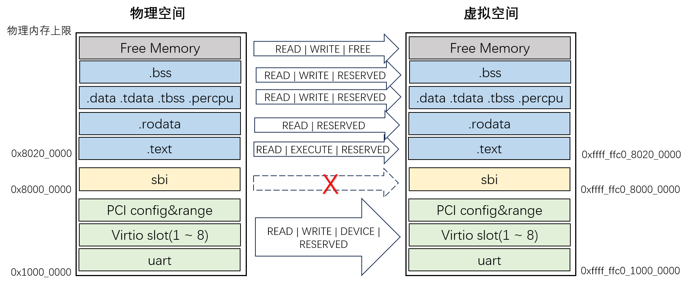


## 实验0.25

### 涉及组件

XXX

### 操作步骤

```sh
lk chroot rt_page_table
lk prepare
lk run
```

### 预期结果

查看日志输出：

```sh
[  0.066729 rt_page_table:34] Try to access virtio_mmio [0x74726976]
[  0.067551 rt_page_table:37] [rt_page_table]: ok!
```


# 日志logging

## 系统构成

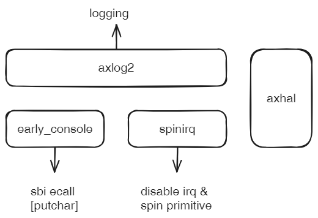

内核日志服务。直接基于最基础的早期控制台功能和自旋锁。

axlog2借助了rust log框架，该组件的内部构成：

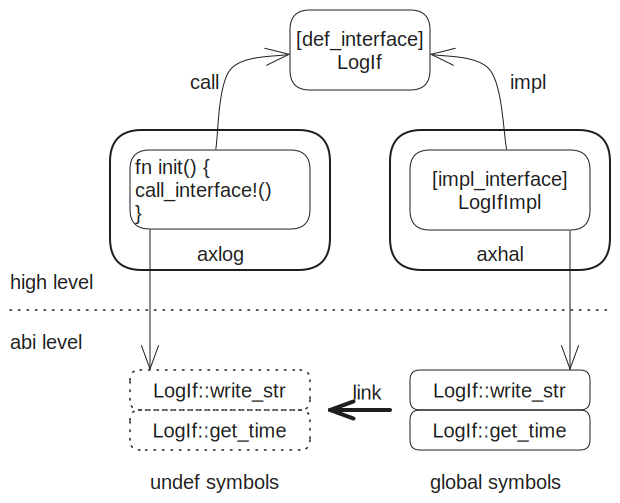


## 实验0.26

### 涉及组件

XXX

### 操作步骤

```sh
lk chroot rt_axlog2
lk prepare
lk run
```

### 预期结果

查看日志输出：

```sh
[  0.037773 rt_axlog2:12] [rt_axlog2]: ...
[  0.039963 rt_axlog2:13] [rt_axlog2]: ok!
```


# 自旋锁spinlock

## 系统层次

自旋锁分为三个层级：spinraw - 仅锁， spinirq - 锁+关中断， spinpreempt - 锁+关中断+关抢占。

这些自旋锁与其它主要相关部分的层次关系。

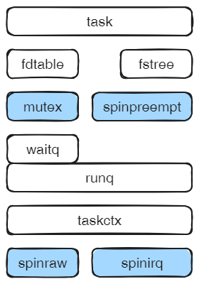


## 实验0.27

### 涉及组件

XXX

### 操作步骤

```sh
lk chroot rt_xxx
lk prepare
lk run
```

### 预期结果

查看日志输出：


# 内存动态分配axalloc

## 系统构成

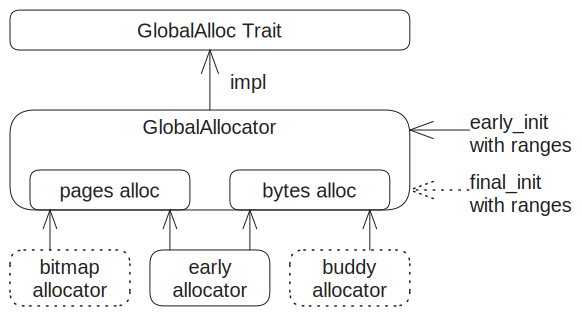

为整个内核系统提供动态内存分配服务。包括基于字节和基于页的分配方式。

> 后面工作：对各种内存分配器组件进行进一步的测试验证。


## 实验0.28

### 涉及组件

XXX

### 操作步骤

```sh
lk chroot rt_axalloc
lk prepare
lk run
```

### 预期结果

查看日志输出：

```sh
[  0.049754 rt_axalloc:19] Alloc string: Hello, axalloc!
[  0.050345 rt_axalloc:20] [rt_axalloc]: ok!
```


# 控制台驱动earlycon

## 实验0.29

### 涉及组件

XXX

### 操作步骤

```sh
lk chroot rt_early_console
lk prepare
lk run
```

### 预期结果

查看日志输出：

```sh
[early_console]: Hello, ArceOS!
```


# 架构无关层axhal

## 实验0.30

### 涉及组件

XXX

### 操作步骤

```sh
lk chroot rt_axhal
lk prepare
lk run
```

### 预期结果

预期日志输出：

```tex
[  0.045980 rt_axhal:30] [rt_axhal]: ok!
```

> 考虑把最底层的hal独立为base，封装terminate。


# 系统配置config

## 实验0.31

### 涉及组件

XXX

### 操作步骤

```sh
lk chroot rt_axconfig
lk prepare
lk run
```

### 预期结果

作为纯粹的框架，日志无输出。查看qemu.log，最后显示：

```tex
----------------
IN:
Priv: 1; Virt: 0
0xffffffc0802000ba:  a001              j               0               # 0xffffffc0802000ba
```

停在无限循环。跟踪从0x80200000开始直到该位置的汇编，与arch_boot的汇编一致。


# 需求分解示例

## 启动过程的分解

XXX

## 基于LTP的需求分解

综合分析ltp的mmap，以它们的需求为源头。总共20个测试用例。

| 测试用例 | 需求                             |
| -------- | -------------------------------- |
| mmap01   | 通过system()执行grep             |
| mmap04   | /proc/self/maps                  |
| mmap06   | 文件描述符权限                   |
| mmap12   | /proc/self/pagemap               |
| mmap13   | 信号：SIGBUS signal not received |
| mmap14   | /proc/self/status                |
| mmap16   | no mkfs.ext4                     |
| mmap18   | futex                            |

综合来看，排在首位的是/proc/self下的结点，其实还包括（/proc/self/oom_score_adj）。

可以把任务分解分配给axmount组件，先实现这些/proc/self。

其次是与信号相关，经由task，在signal中处理。

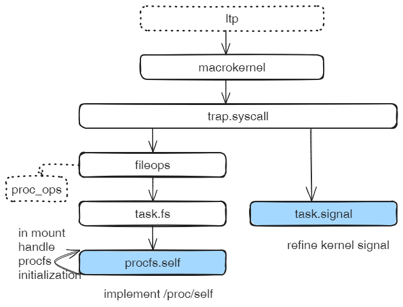

需求从顶层传递到蓝色部分，蓝色部分是具体实现的位置。根据需求形成测试用例，只在蓝色部分中实现。蓝色部分上层依赖链，原则上应该逐级以测试用例形式在更高规模进行测试，直至macrokernel。为方便，可以间隔测试。


任务步骤：

1. 建立procfs处理的框架
2. 按需要扩展具体的/proc/xxx

第1步考虑是必要的任务，第2可延后分配任务，协同完成。


进一步分析第1步，发现原有实现在支持procfs方面存在问题：

之前考虑的fs主要是fat32，ramfs之类的都是数据型（读写缓冲区）

而伪文件系统procfs它需要暴露以进程为中心的信息，与之前fs的区别：

1. 当read时，信息是动态即时生成的，所以不适合基于数据结点，而应该是一个可调用的方法。目前arceos里面procfs的实现基于ramfs，并不完全适应当前的需要。
2. 既然procfs是以进程信息管理为中心的，那么它的位置必然要比task的位置高，而原来fat32/ramfs的位置都是比较低的，低于task；如果把所有的fs的位置都调高，又可能会引起其它相关组件的调整，有不可控的工作量。

根本解决办法是：类似于fileops和file的做法，把fs分为fsops(inode_ops)和fs(inode)，把数据和操作分离，分别放在task的上面和下面。

但改动有点大，先采取折中方法：在fileops截获NotFound错误，并检查路径以/proc开头的，就转入procfs_ops中处理。


# 附录

## A. 未整理的想法

1. lkmodel的目的：找到一种方法，能够把内核开发和维护的复杂性问题转化为简单问题，把简单问题解决后的结果综合起来，就能解决那个分解前的复杂问题。

2. lkmodel对复杂性问题的分解实际上是对系统需求分解：

   顶层需求来自于应用发出的syscall + procfs + ...，这个需求可以用ltp之类的测试用例来具体表现。自顶向下，每一级的需求都可以分解到对下一级子系统的需求，直至那些小规模的简单的子系统。需求是每一级子系统的具体实现需求，都可以转化为本级leader组件的接口规格和测试用例；每一级只需要实现接口和通过测试用例验证。需求的分解传递，保证了把各级子系统的实现反向综合起来，能够满足顶层的需求。

3. 关于rt_xxx和test_xxx的区别：虽然都是根组件，但有不同的考虑。

   * rt_xxx源自对某个顶级系统的需求的分解，比如宏内核或unikernel。rt_XXX从属于某一棵需求树，只满足该树的需求。当从另一棵树的需求分解下来，发现不满足时，要增加一个并列的rt_xxx。宏内核需求树的rt_xxx默认无后缀，Unikernel加后缀uni。
   * test_xxx侧重测试覆盖率，不管从属于哪棵树。

4. 组件模型包括层次模型和过程模型。目前主要考虑的都属于层次模型，下步要考虑过程模型。过程模型就是在一个子系统中，分为趟（Pass）和阶段（Stage）。Pass是一个相对独立的完整的过程，而Stage是过程中的一个连续运行的阶段。两个例子：

   * mmap映射：实际包括两个相对独立的过程，Pass0和Pass1。Pass0只负责建立虚拟内存地址区域，并不负责分配实际物理页面并与之建立映射关系，它从syscall发起，到建立vma结束；Pass1即由缺页异常触发的映射关系的完成，期间可能会去申请物理页面和加载对应文件块的内容。两趟Pass共同完成mmap映射，有因果关系，但它们之间又是相对独立的两个过程。
   * SMP共享访问资源：每个CPU的过程都是一趟Pass，对每个Pass来说，访问共享资源是一个特殊的Stage，其它Stage则是各个CPU过程独占的阶段，当跨越阶段边界时，通常意味着等待和唤醒等状态的变化，这些边界通常是**状态一致点**。

   过程模型想要解决的问题：把一个子系统按照过程维度，分解成多个Pass，再进一步把每一个Pass分解为多个Stage。按照先简单问题，后问题综合叠加的思路，来处理复杂性问题。

5. 进一步解释层次模型中的Pass，每一个Pass都可以看作是由一个事件触发的，由一连串阶段构成的，会导致一定结果的场景。触发事件主要包括：启动事件、syscall调用（可能还要区别具体参数）、异常、访问procfs/sysfs的特定结点（从syscall_read中单立出来）。中间的各个阶段就是stage。最终结果包括：应用或硬件或仅仅是内核内部状态发生变化。

6. 过程模型和层次模型两个维度分解的目的：它们分别代表按照时间维度和空间维度的分解。从不同维度把叠加的复杂问题分解为独立的简单问题。

7. XXX


## B. LTP实现情况

### syscalls实现情况

| 测试集 (总：已/未) | 已通过                                                      | 未通过             |
| ------------------ | ----------------------------------------------------------- | ------------------ |
| mmap (20: 15/5)    | 001, 02, 03, 04, 05, 08, 09, 10, 11, 12, 14, 15, 17, 19, 20 | 01, 06, 13, 16, 18 |
| xxx                | xxx                                                         | xxx                |
